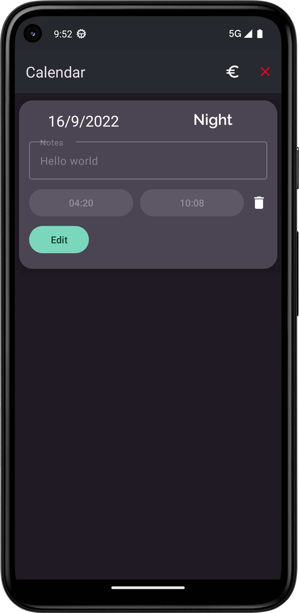

# Work Days

With this app you are able to: 
* select the days you have worked 
* add your shift
* add notes
* add start / end time of work
* edit saved info
* delete records
* mark records as paid or unpaid 
* automatically calculate your income based on the selected daily wage 

# Screenshots

</img> | </img> | </img> 
|---|---|---|
 | </img> </img> | </img> 
</img>  